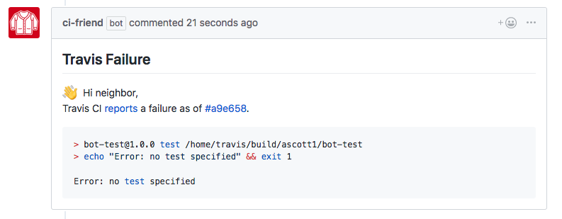

> A helper bot for understanding Travis CI build failures. Built with [Probot](https://github.com/probot/probot) :robot:

## Features

ci-friend extracts failing test results from a [Travis CI](https://travis-ci.org/) job log and posts them as a comment to the appropriate pull request.



Here is an [example pull request](https://github.com/ascott1/bot-test/pull/7) with a comment from `ci-bot`.

## Current limitations

- Currently only works with `npm test`
- Currently only tested with Jest
- Assumes a single Travis CI job

## Setup

First clone the repostiory, insall the dependencies, and copy the `.env` file:

```sh
git clone git@github.com:ascott1/ci-friend.git
cd ci-friend
npm install
cp .env.example .env
```
Next, follow the steps found at [Configuring a GitHub App](https://probot.github.io/docs/development/#configuring-a-github-app)

Additionally, login to Travis and add your [Travis Token](https://developer.travis-ci.com/authentication) to `.env`

Now you're ready to run your app!

```
npm run dev
```

To run tests:

```
npm test
```

## Contributing

All contributions and suggestions are welcome!

For suggested improvements, please [file an issue](https://github.com/ascott1/ci-friend/issues).

For direct contributions, please fork the repository and file a pull request. If you've never created a pull request before, welcome! :tada: :smile: [Here is a great tutorial](https://egghead.io/series/how-to-contribute-to-an-open-source-project-on-github) on how to send one.

For more, check out the [Contributing Guide](CONTRIBUTING.md).

## Code of Conduct

In the interest of fostering an open and welcoming environment,the contributors and maintainers pledge to making participation in our project and our community a harassment-free experience for everyone, regardless of age, body size, disability, ethnicity, gender identity and expression, level of experience, nationality, personal appearance, race, religion, or sexual identity and orientation.

Please be sure to read and adhere to our [Code of Conduct](CODE_OF_CONDUCT.md).

## Approach

I've never worked with Probot or GitHub applications before. Here's an outline of my approach to learning Probot and the development of this app:

1. Read through the [Probot documentation](https://probot.github.io/) and build a simple 'Hello World' application.
2. Search GitHub for example Probot apps and read through their code.
3. Modify my 'Hello World' application to comment on GitHub issues.
4. Read the GitHub webhook documentation to find the appropriate hook for CI failure events.
5. Read the Travis CI API documentation to understand what it returns and where to get the log files.
6. Write psuedo-code outlining the steps that the application needs to take.
7. Create the `ci-friend` repo and integrate the basic issue posting code.
8. Add a failed Travis build fixture to easily trigger the correct status event.
9. Write code and corresponding tests, following the steps outlined in my pseudo-code:
  1.  Listen for failure events
  2.  Extract useful information from the Travis `build` API
  3.  Get the contents of the Travis log file
  4.  Extract the relevant information from the log file
  5.  Create a template for the GitHub comment
  6.  Post the comment to the appropriate pull request
10. Once this was completed, I wrote a functional test for the main application file.
11. Re-visit the tests and perform some additional cleanup

Additionally, the [commit history](https://github.com/ascott1/ci-friend/commits/master) may be helpful in demonstrating an overview of the development process.

## Challenges

- I was unsure of which GitHub permissions to select. At first, I selected only those that I thought I needed but found that my permissions were lacking. This led to me selecting more permissions than necessary, which is OK for local development but would need to be refined before release.
- I initially struggled to track down the correct webhook for build failures. I spent a lot of time looking for something in the `pull_request` API, but eventually tracked down the [status event](https://developer.github.com/v3/activity/events/types/#statusevent).
- Another challenge was finding the number of the appropriate pull requests when the failure status was returned. Initially, I attempted extracting the PR number from the SHA of the latest commit, but this felt brittle and made an additional request. In the end, I settled on getting it from the Travis API `build` which I needed to call to get the Travis job/log and returns `pull_request_number`.
- The Travis `build` ID and `job` ID were very similar (at least in my test-case), which led to some bad requests and confusion.
- Currently parsing the logs uses a very simplistic `split()` that extracts an `npm test` error. To make this application more robust and to work with multiple languages would require more advanced pattern matching.
- Using JavaScript template literals and Jests's `toMatch()` resulted in strings that appeared to match, but caused test failures. I needed to be very careful about whitespace in the template literals!
- Testing the `index.js` file felt daunting, but the Probot [testing documentation](https://probot.github.io/docs/testing/) and the linked example apps were helpful. Now that Probot defaults to Jest, it would be even more helpful for the docs to link to Jest testing examples.

## License

[ISC](LICENSE) © 2018 Adam Scott <ascott1@gmail.com>

Cardigan icon by [Artem Kovyazin](https://thenounproject.com/kosmofish/). Used with permission.
